# LessURL

## 멋쟁이사자 인턴쉽 프로젝트

LessURL은 AWS 서버리스 서비스(Lambda, API Gateway, DynamoDB)를 활용한 URL 단축 서비스입니다. 긴 URL을 짧은 코드로 변환하고, 클릭 시 원본 URL로 리다이렉트합니다. 클릭 통계(시간대별, 리퍼러별)를 수집하고, AI가 인기 URL 패턴을 분석하여 트렌드를 제공합니다.

### 주요 기능

*   **URL 단축:** 긴 URL을 고유한 짧은 ID와 URL로 변환합니다. (예: `https://example.com/long-url` -> `https://[your-api-domain]/prod/shorten`)
*   **URL 리디렉션:** 짧은 URL로 접근 시 원본 URL로 자동으로 리디렉션합니다. (예: `https://[your-api-domain]/prod/abc12345` -> `https://example.com/long-url`)
*   **클릭 통계:** 생성된 짧은 URL의 총 클릭 수 및 상세 클릭 통계(시간별, 일별, 레퍼러별)를 제공합니다.
*   **서버리스 아키텍처:** AWS Lambda, API Gateway, DynamoDB를 활용하여 확장성, 고가용성, 비용 효율성을 제공합니다.

### 아키텍처 (Architecture)

```mermaid
graph TD
    subgraph Frontend
        F1[Client Browser] -- HTTPS --> CF(CloudFront CDN)
        CF --> S3(S3 Bucket for Static Hosting)
    end

    subgraph Backend API
        F1 -->|API Requests| GW(API Gateway)
        GW -->|POST /shorten| C1(ShortenFunction Lambda)
        GW -->|"GET /&#123;shortId&#125;"| C2(RedirectFunction Lambda)
        GW -->|"GET /stats/&#123;shortId&#125;"| C3(StatsFunction Lambda)
    end

    subgraph Database
        C1 -->|Write/Read| D1(DynamoDB UrlsTable)
        C2 -->|Read Url & Write Clicks| D1
        C2 -->|Write Clicks| D2(DynamoDB ClicksTable)
        C3 -->|Read Urls & Query Clicks| D1
        C3 -->|Query Clicks| D2
    end

    subgraph Monitoring
        CL[CloudWatch Logs]
        CM[CloudWatch Metrics]
        GW --> CL
        GW --> CM
        C1 --> CL
        C1 --> CM
        C2 --> CL
        C2 --> CM
        C3 --> CL
        C3 --> CM
    end
```



AWS Lambda, API Gateway, DynamoDB, S3, CloudFront, CloudWatch를 사용하여 구축될 서버리스 아키텍처입니다.

### API 엔드포인트

LessURL은 다음과 같은 API 엔드포인트를 제공합니다.

#### 1. URL 단축 (Shorten URL)

*   **기능:** 긴 URL을 짧은 URL로 변환하고 DynamoDB에 저장합니다.
*   **엔드포인트:** `POST /shorten`
*   **요청 (Request Body - application/json):**
    ```json
    {
      "url": "https://www.example.com/very/long/url",
      "title": "Example Website Title (Optional)"
    }
    ```
*   **응답 (Response Body - application/json - 200 OK):**
    ```json
    {
      "shortId": "abc12345",
      "shortUrl": "https://[your-api-domain]/prod/abc12345"
    }
    ```
*   **에러 응답:**
    *   `400 Bad Request`: `url` 필드 누락 또는 빈 값.
    *   `500 Internal Server Error`: 서버 내부 오류.

#### 2. URL 리디렉션 (Redirect URL)

*   **기능:** 짧은 URL로 접근 시 원본 URL로 리디렉션합니다.
*   **엔드포인트:** `GET /{shortId}`
*   **요청 (Path Parameter):** `shortId`
*   **응답 (301 Moved Permanently):**
    *   `Location` 헤더: 원본 URL
*   **에러 응답:**
    *   `400 Bad Request`: `shortId` 파라미터 누락.
    *   `404 Not Found`: `shortId`에 해당하는 URL을 찾을 수 없음.
    *   `500 Internal Server Error`: 서버 내부 오류.

#### 3. URL 통계 (Get URL Stats)

*   **기능:** 특정 `shortId`에 대한 상세 클릭 통계를 조회합니다.
*   **엔드포인트:** `GET /stats/{shortId}`
*   **요청 (Path Parameter):** `shortId`
*   **응답 (Response Body - application/json - 200 OK):**
    ```json
    {
      "clicks": 15, // 총 클릭 수
      "stats": {
        "originalUrl": "https://www.example.com/very/long/url",
        "title": "Example Website Title", // title이 있는 경우
        "clicksByHour": {
          "9": 5,
          "10": 10
        },
        "clicksByDay": {
          "2026-02-05": 15
        },
        "clicksByReferer": {
          "direct": 8,
          "www.google.com": 7
        },
        "peakHour": 10, // 가장 클릭이 많았던 시간
        "topReferer": "www.google.com", // 가장 많은 유입을 보인 레퍼러
        "period": "7d" // 통계 집계 기간 (현재는 7일)
      }
    }
    ```
*   **에러 응답:**
    *   `400 Bad Request`: `shortId` 파라미터 누락.
    *   `404 Not Found`: `shortId`에 해당하는 URL을 찾을 수 없음.
    *   `500 Internal Server Error`: 서버 내부 오류.

### 개발 환경 설정 (Local Development Setup)

1.  **AWS SAM CLI 설치:**
    *   [AWS SAM CLI 설치 가이드](https://docs.aws.amazon.com/serverless-application-model/latest/developerguide/serverless-sam-cli-install.html)를 참조하여 SAM CLI를 설치합니다.
2.  **Java 21 설치:**
    *   프로젝트는 Java 21을 사용합니다. [OpenJDK](https://openjdk.java.net/install/index.html) 등을 통해 설치합니다.
3.  **Gradle 설치:**
    *   프로젝트는 Gradle Wrapper를 포함하고 있으므로 별도 설치 없이 `gradlew` 스크립트를 사용할 수 있습니다.
4.  **의존성 설치:**
    *   프로젝트 루트(`LessUrlFunction` 디렉토리)에서 `./gradlew build` 명령을 실행하여 필요한 의존성을 다운로드하고 프로젝트를 빌드합니다.

### 배포 (Deployment)

1.  **SAM 빌드:**
    ```bash
    sam build
    ```
2.  **SAM 배포:**
    ```bash
    sam deploy --guided
    ```
    *   `--guided` 옵션을 사용하면 스택 이름, AWS 리전 등 배포에 필요한 정보를 대화형으로 설정할 수 있습니다.

### 테스트 (Testing)

*   **단위 테스트:**
    *   IntelliJ IDEA에서 JUnit 5 기반의 테스트 코드를 실행할 수 있습니다.
    *   프로젝트 루트(`LessUrlFunction` 디렉토리)에서 `./gradlew test` 명령을 실행할 수도 있습니다.
*   **API 테스트:**
    *   IntelliJ IDEA Ultimate의 내장 HTTP Client 또는 Postman과 같은 도구를 사용하여 배포된 API 엔드포인트를 테스트할 수 있습니다.
    *   `LessUrlFunction/api-requests.http` 파일을 참조하여 각 API 엔드포인트의 요청 및 응답 예시를 확인할 수 있습니다.
